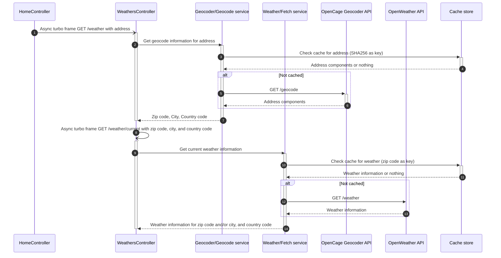

# WeatherOnRails

## 📦 Requirements

- Ruby
- Redis
- OpenWeatherMap API key: https://openweathermap.org/
- OpenCage API key: https://opencagedata.com/

## ⚡️ Setup

```bash
$ bin/setup
```

Add your OpenWeatherMap API key to the `.env.local` file

```bash
OPEN_WEATHER_API_KEY=REPLACE_ME
```

Add your OpenCage API key to the `.env.local` file

```bash
OPEN_CAGE_API_KEY=REPLACE_ME
```

## 🚀 Running

```bash
$ bin/dev
```

## 🧪 Testing

```bash
$ bundle exec rspec
```

## 📝 Codestyle

```bash
$ bundle exec rubocop
```

## 💽 Caching

The app uses Redis to cache the weather data per country and zip code. The cache is set to expire after 30 minutes.

By default, caching is disabling in the development environment. To toggle it, run `rails dev:cache`.

# How it works

## Overview

WeatherOnRails is a lightweight Ruby on Rails web application that displays weather information for a given address.

Upon entering an address on the home page:

1. The address is geocoded to retrieve the zip code, city, and country code using the OpenCage Geocoder API.
2. Weather information is then fetched for the retrieved zip code and/or city, and country code using the OpenWeather API.
3. The weather information is displayed.

## Architecture

The core of the app consists of two service objects:

- `Geocoder::Geocode`: responsible for geocoding an address.
- `Weather::Fetch`: responsible for fetching the weather information.

There's no persistent database (e.g. Postgres), as there's no business need for it (yet). Only Redis is used as a cache store.

This simple architecture allows to efficient scaling to handle high traffic needs.

### Sequence

When the user enters an address, the following sequence of events happens:



### External APIs

The app uses two external APIs:

- [OpenCage Geocoder](https://opencagedata.com/api): to geocode an address and retrieve the zip code, city, and country code.
- [OpenWeather](https://openweathermap.org/api): to obtain the weather information for a given zip code and/or city, and country code.

Both APIs are used exclusively through the service objects, and their responses are cached as necessary.
For instance, the weather information is cached per zip code and country for 30 minutes.

### Service Objects

Service objects encapsulate the business logic (e.g. geocoding an address, fetching weather information), keeping controllers thin, and making the code easier to test in isolation.
They are located in the `app/interactions` directory, and are based on the [ActiveInteraction](https://github.com/AaronLasseigne/active_interaction) gem.

When these service objects are run, they provide a `valid?` method to check if the execution was successful. This is useful for handling cases when, for example, the user enters an invalid address, there's no weather information available, or when the API calls fail.

In terms of naming conventions, the service objects are named after the action they perform, and are located in a directory named after the resource (or namespace) they act upon. For example, `Weather::Fetch` is responsible for fetching weather information, and is located in the `app/interactions/weather` directory.

### Async rendering

Hotwire is used to asynchronously fetch the geocode and weather information for a given address.
This works by using Turbo Frames that have a `src` attribute, and their content is replaced with the response of the request made to that URL.
This approach, which does not require any JavaScript, provides immediate feedback to the user while geocode and weather information requests are processed in the background.

## Future considerations

- Add a database for the geocode information. This will, in the long run, reduce the number of API calls to the OpenCage Geocoder API to the minimum.
- Additional external APIs that can extend the information, validate, and/or reduce the risk of downtime.
- Use websockets to push the weather information from a background job (e.g. Sidekiq).
- Periodically pre-fetch the weather information of the most popular locations.
- Use the browser's geolocation API to automatically retrieve the weather information for the user's location.
- Further encapsulate the response for geocode and weather information.
