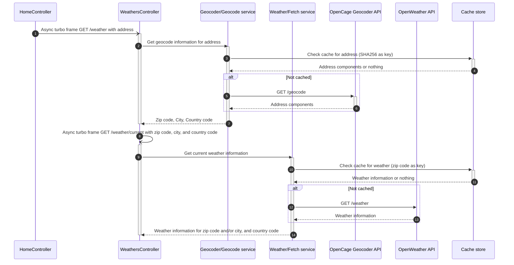

# WeatherOnRails

## 📦 Requirements

- Ruby
- Redis
- OpenWeatherMap API key: https://openweathermap.org/
- OpenCage API key: https://opencagedata.com/

## ⚡️ Setup

```bash
$ bin/setup
```

Add your OpenWeatherMap API key to the `.env.local` file

```bash
OPEN_WEATHER_API_KEY=REPLACE_ME
```

Add your OpenCage API key to the `.env.local` file

```bash
OPEN_CAGE_API_KEY=REPLACE_ME
```

## 🚀 Running

```bash
$ bin/dev
```

## 🧪 Testing

```bash
$ bundle exec rspec
```

## 📝 Codestyle

```bash
$ bundle exec rubocop
```

## 💽 Caching

The app uses Redis to cache the weather data per country and zip code. The cache is set to expire after 30 minutes.

By default, caching is disabling in the development environment. To toggle it, run `rails dev:cache`.

# How it works

## Overview

WeatherOnRails is a lightweight Rails 7 webapp that uses Hotwire to asynchronously fetch the weather information for a given address.

When a user enters an address:
1. OpenCage Geocoder API is called to get the zip code, city, and country code of the address.
2. OpenWeather API is called to get the current weather information for the zip code and/or city, and country code.
3. The weather information is displayed to the user.

## Architecture

To support scalability, the app is designed to be as lightweight as possible.
There's no persistent database (e.g. Postgres). Only Redis is used as a cache store.

The app is composed of two services:
- `Geocoder::Geocode`: responsible for getting the geocode information of an address, using the OpenCage Geocoder API.
- `Weather::Fetch`: responsible for getting the weather information of a zip code and/or city, and country code, using the OpenWeather API.

These services are used by the `WeathersController` to fetch the weather information for a given address.



## Caching

Both of OpenCage and OpenWeather APIs are rate limited. To avoid hitting the rate limit, we cache the results of the API calls.
For the weather information, the cache is set to expire after 30 minutes, and we use the zip code as the key.
For the geocode information, we use the SHA256 of the address as the key.

The cache store is configurable, and we're using Redis by default.

## Service Objects

The app uses service objects to encapsulate the business logic of the app.
These are located in the `app/interactions` directory, and are based on the [ActiveInteraction](https://github.com/AaronLasseigne/active_interaction) gem.

They provide a simple and consistent interface, with just a `run` (or `run!`) method, and a `result` method to access the returned object.
They also provide a `valid?` method to check if the execution is valid or not. This can be seen when the user enters an invalid address, there's no weather
information, or when the API calls fail.

As naming convention, the service objects are named after the action they perform, and are located in a directory named after the resource they act on.
E.g. `Geocoder::Geocode` is responsible for geocoding an address, and is located in the `app/interactions/geocoder` directory.
